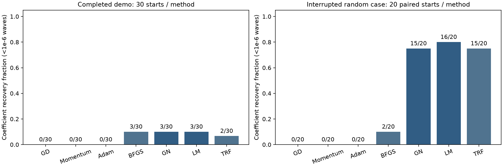

# 单帧无调制 Zernike 系数反演：阶段实验报告

日期：2026-09-28。状态：**用户要求停止，后台求解与监督进程已退出，未继续运行新实验。**

## 结论

当前证据支持优先保留 **GN、LM、TRF、BFGS** 作为后续重点比较对象。它们在已有样本上能从部分非零初值恢复出高精度系数，但仍存在明显的初值依赖。GD、Momentum、Adam 在当前默认参数和预算下总体精度较低；这不足以说明调参后的一阶方法仍然较差。

目前有两个不同真值的结果：一个完整历史案例，以及一个随机波前的部分初值实验。**100 个随机真值的大规模实验没有完成，不能据此给出统计意义上的总体算法排名。**

## 1. 数据范围与运行状态

| 数据集 | 原定规模 | 实际完成 | 本报告比较范围 |
|---|---:|---:|---|
| 历史演示案例 | 1 真值 × 31 初值 × 7 方法 = 217 次 | 217 次，完整 | 30 个非零初值/方法；零初值单独诊断 |
| 随机波前实验 | 100 真值 × 30 初值 × 7 方法 = 21,000 次 | 141 次，约 0.67% | 第一个真值的 20 个共同初值 × 7 方法 = 140 次 |

随机实验尚无任何一个真值完成全部 30 初值。141 次中的额外一次为 TRF 在初值 20（0.3 waves RMS）上的运行；原始结果予以保留，但不纳入算法对比，避免样本不配对。

两套原始 CSV 均保留；随机实验 141 条压缩轨迹可以完整读取。任务状态及数据元信息已标为 `stopped_by_user`，不会把此次停止解释为完成或算法故障。

## 2. 共同实验条件

- 128×128 全图、单帧原始光强，无相移序列、无附加空间载频、无噪声。
- 默认棋盘光栅五光束相干叠加模型，拟合 Fringe Z2…Z13，共 12 个参数，排除不可观测的 Z1。
- 各算法共用前向模型、解析雅可比、像素、初值和 RMS 参数尺度；直接优化光强均方残差。
- 每次最多 500 次前向计算、500 次雅可比计算，默认梯度容差为 1e-10。默认 Momentum/Adam 学习率为 0.01，未做独立验证集调参。
- 七种算法使用同一份观测；多初值最终结果只按**观测损失最小**选择，真值只用于事后评价。
- 正式比较串行执行。表中时间为已完成求解的累计测量值，不含预计算、后处理、未完成求解或进程等待时间，也不是等时间预算排名。
- 当前共有 37 项测试通过，覆盖旧流程及新增导数、物理等价、预算、选解和报告逻辑。

## 3. 评价口径

**系数恢复**沿用原项目标准：允许全部系数共同变号后，最大系数误差 <1e-6 waves。不能逐项翻转符号。

**波前误差**为光瞳内去 piston、允许共同变号后的波前 RMS 误差。多初值表中的波前误差是观测选解所得结果，不是按真值挑选的最好误差。

**相对波前误差**定义为波前 RMS 误差 / 真值波前 RMS。本报告为小像差样本补充 <1% 的描述性指标；该指标是在中止后为解释结果增加的，未用于求解或调参。

原始自动报告还包含“系数误差 <1e-6 且光强残差 <1e-10”的联合严格标准。该残差门槛可能把已经高精度恢复系数的运行记为不成功：完整案例中最佳 LM 的系数误差约 3.18e-9 waves，但光强 RMS 残差为 1.037e-10，略高于门槛；BFGS 也有类似情况。因此本报告以系数恢复和连续波前误差为主，不把联合标准与历史标准混为一谈。

## 4. 完整历史案例

真值为 Z4=0.31、Z5=−0.12、Z6=0.07、Z7=0.42、Z8=0.05 waves，其余拟合项为零；光瞳波前 RMS 约 0.240046 waves。10 个系数空间随机方向分别缩放到 0.03、0.1、0.3 waves RMS。

| 方法 | 系数恢复 | 波前误差 <0.01 waves | 观测选解后的波前误差 / waves | 总求解秒数 |
|---|---:|---:|---:|---:|
| GD | 0/30 | 0/30 | 5.206e-02 | 47.81 |
| Momentum | 0/30 | 0/30 | 1.903e-01 | 46.13 |
| Adam | 0/30 | 1/30 | 3.142e-03 | 47.55 |
| BFGS | 3/30 | 3/30 | 1.475e-09 | 13.13 |
| GN | 3/30 | 3/30 | 1.833e-12 | 7.03 |
| LM | 3/30 | 3/30 | 2.406e-09 | 7.05 |
| TRF | 2/30 | 2/30 | 1.593e-14 | 7.33 |

观察：

- GN、LM、BFGS 的系数恢复率均为 3/30，TRF 为 2/30，说明好初值可以带来很高精度，但大量初值仍会落入其他解。
- GD、Momentum 的 30 次运行均用尽前向计算预算；Adam 同样用尽预算，其中一次达到 0.01 waves 的波前误差标准。
- GN、LM、BFGS、TRF 在许多不正确的波前上也满足了数值停止条件，**停止不是恢复成功**。
- 每种方法完成相同初值池的总成本不同。已有累计时间曲线可辅助观察有限时间内的选解表现，但只基于一个真值。
- 零初值七种方法均未恢复；其失败符合当前模型 `J(0)=0` 的性质。

## 5. 中止随机实验：20 个共同初值的结果

仅涉及第一个随机稠密波前，真值 RMS 为 **0.01 waves**。共同初值为 10 个模态 RMS 坐标随机方向，各取 0.03 和 0.1 waves RMS；0.3 waves 组没有完整配对，因此不参与比较。

| 方法 | 系数恢复 | 相对波前误差 <1% | 观测选解后的波前误差 / waves | 总求解秒数 |
|---|---:|---:|---:|---:|
| GD | 0/20 | 0/20 | 2.372e-02 | 38.41 |
| Momentum | 0/20 | 0/20 | 2.996e-02 | 37.67 |
| Adam | 0/20 | 2/20 | 2.855e-06 | 39.35 |
| BFGS | 2/20 | 18/20 | 7.059e-07 | 29.71 |
| GN | 15/20 | 18/20 | 4.232e-11 | 2.06 |
| LM | 16/20 | 18/20 | 3.316e-11 | 3.07 |
| TRF | 15/20 | 18/20 | 4.232e-11 | 2.80 |

观察：

- 在这个样本和这组初值上，GN、LM、TRF 分别有 15/20、16/20、15/20 次达到系数恢复标准；三者均有 18/20 次达到相对波前误差 <1%。
- BFGS 有 18/20 次达到相对波前误差 <1%，但只有 2/20 次达到更严格的系数标准。其按光强残差选出的解最大系数误差约 1.043e-6 waves，略高于门槛；不能因此改用真值误差挑选另外两次运行。
- Adam 有 5/20 次达到原绝对波前门槛 0.01 waves，但只有 2/20 次达到相对误差 <1%。这一差别说明小像差场景下必须同时看相对精度。
- GD、Momentum 的最佳观测选解误差仍大于真值 RMS；当前设置和预算不足以获得可用恢复。
- 不能把这一组较高的成功率直接归因于“小像差更容易”：真值结构、初值生成坐标和幅度组都与历史案例不同，没有进行控制变量比较。

图中两组分母分别为 30 和 20，表示同一真值上的不同初值运行，不是独立波前样本数。

## 6. 目前能与不能得出的结论

**能支持的判断：** 直接拟合单帧无调制强度在已有样本上可恢复 Zernike 系数的等价解；利用最小二乘结构的 GN/LM，以及 TRF、BFGS，值得作为强基线继续研究。初值与停止标准对结果的影响很大。

**尚不能支持的判断：** 任一方法普遍最优；全部 100 个波前上的成功率；噪声鲁棒性；实测可用精度；单帧能够确定绝对波前符号。当前实振幅模型保留整体正负号和倾斜周期等价性，优化器不能消除这些观测歧义。

当前只有两个真值，初值还复用了随机方向，不宜把所有运行当成独立样本计算总体置信区间。学习率、预算和参数尺度的选择也影响一阶与二阶方法的比较。

## 7. 后续建议（本次不执行）

若后续继续，建议先缩小为 **10 个独立波前 × 5 个共享非零初值 × GN/LM/TRF/BFGS = 200 次求解**，均衡覆盖不同波前 RMS。再单独给一阶方法设置小规模验证集调参，并锁定预算后比较。

评价预先固定为：系数误差、绝对/相对波前误差、按观测选解的成功率和实际计算时间。先回答能否可靠恢复，再扩展噪声及模型失配，避免再次直接启动庞大全组合。

## 8. 数据索引

- [本报告汇总 CSV](results/stage/summary.csv)
- [完整案例原始结果](results/demo/runs.csv)
- [完整案例自动报告](results/demo/report.md)
- [随机实验全部已完成结果，141 次](results/random-partial/runs.csv)
- [随机实验公平配对子集，140 次](results/random-partial/paired_runs.csv)
- [随机实验任务状态](results/random-partial/status.json)

随机实验输出目录内的 `dataset.npz` 保存的是预先生成的全部 100 个真值与观测；**数据已生成不代表求解已完成**。判断完成范围应以本报告、`runs.csv` 和任务状态为准。

以上链接指向随分支保存的轻量结果快照。完整观测数组、逐步轨迹和源码运行快照仍在原运行机器的 `output/` 中，不随 Git 提交；可用 `configs/` 中的配置重新生成。
