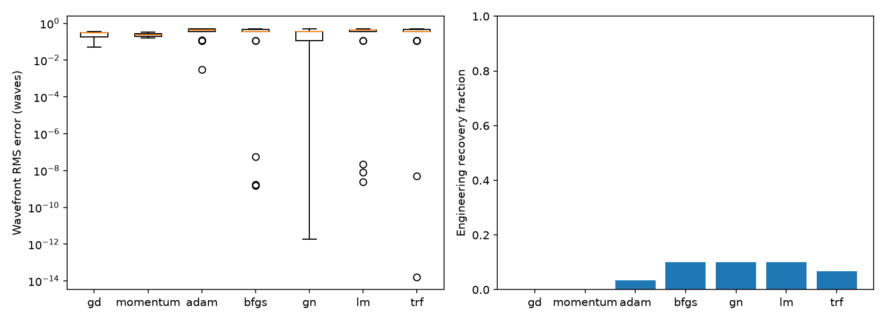
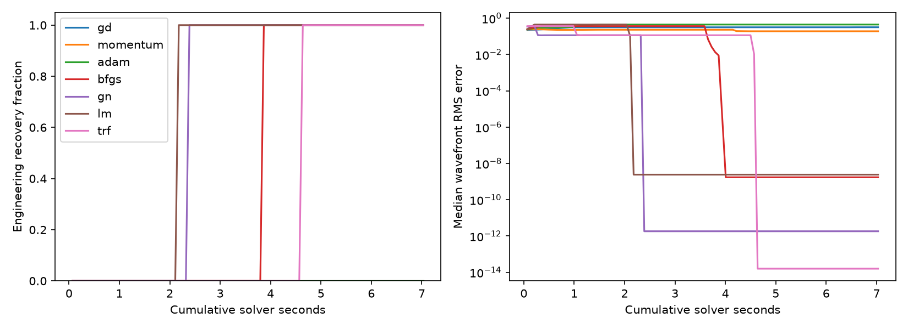

# 单帧无调制优化器实验

所有方法共享单帧观测、非零初值池及 RMS/原始系数坐标配置。
真值只用于事后评价；多初值最终解按观测损失最小选择。
本表为配置指定的有限预算结果，超参数未经独立验证集调优，不能视为算法总体排名。

| 方法 | 严格恢复/非零运行 | 工程恢复/非零运行 | 多初值严格恢复/场景 | 波前误差中位数 | 总秒数 |
|---|---:|---:|---:|---:|---:|
| gd | 0/30 | 0/30 | 0/1 | 3.047e-01 | 47.81 |
| momentum | 0/30 | 0/30 | 0/1 | 2.370e-01 | 46.13 |
| adam | 0/30 | 1/30 | 0/1 | 4.440e-01 | 47.55 |
| bfgs | 0/30 | 3/30 | 0/1 | 3.628e-01 | 13.13 |
| gn | 3/30 | 3/30 | 1/1 | 3.628e-01 | 7.03 |
| lm | 0/30 | 3/30 | 0/1 | 4.440e-01 | 7.05 |
| trf | 1/30 | 2/30 | 1/1 | 3.628e-01 | 7.33 |

严格恢复要求无噪声、整体符号对齐后最大系数误差 < 1e-06 waves，且光强 RMS 残差 < 1e-10。
工程恢复要求整体符号对齐后波前 RMS 误差 < 0.01 waves。
倾斜周期等价误差另存于 runs.csv；不以此掩盖原始系数越出范围。
含噪声运行的 strict_success 留空；请用工程指标及连续误差评价。
零初值不计入上表，详见 runs.csv。停止标记不等于恢复成功。

时间包括求解器的轨迹记录，不含共享预计算、事后评价、绘图及文件写入。
前向/J 计数是真实模型计算，包含拒绝步及仅有残差缓存时补算 J 的前向计算。
梯度计数为适配层的 Jᵀr 计算次数，不含 SciPy/线性求解内部计算。
TRF 的迭代数留空，使用前向/J/时间预算；max_iter 仅适用于其余方法。
轨迹为评价轨迹，包含未接受候选点；每种方法均返回已评价的最低损失点。
固定初值池汇总的实际耗时不同；下图给出按串行搜索顺序累计的观测选解表现。
尚未统计峰值内存、配对置信区间或独立验证集调参结果。

